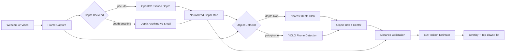
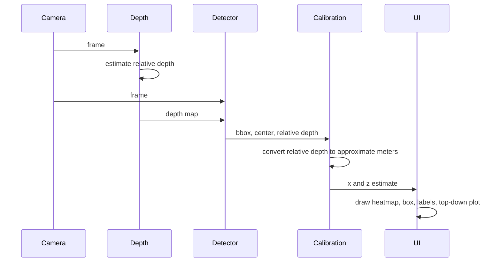
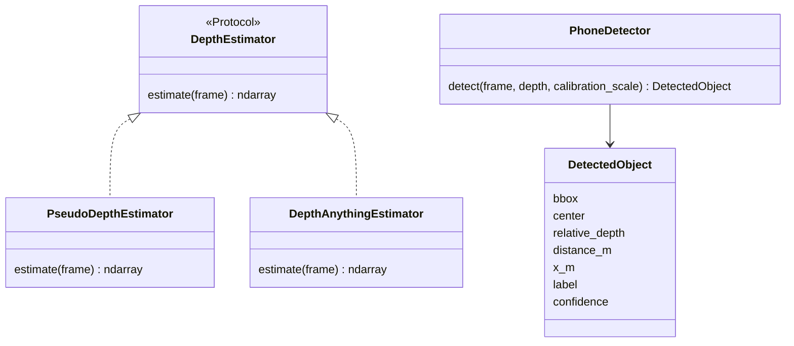

# Monocular Depth Sandbox

A small Windows-friendly computer vision project for learning a real-time perception pipeline:

```text
webcam/video -> depth estimation -> object detection -> calibrated distance -> 3D-style position plot
```

The project starts simple but points toward robotics and ADAS-style perception work. It can run with a fast OpenCV pseudo-depth backend, or with Depth Anything v2 Small on an NVIDIA GPU. It can also use YOLO to detect a phone and estimate how far away it is.

## Agent Change Guideline

Before modifying this project, any agent must perform change impact analysis and give the user a concise overview of affected files, requirements, traceability, risks, and proposed steps. See [AGENTS.md](AGENTS.md) for the required workflow and [CHANGE_IMPACT_ANALYSIS.md](docs/aspice/CHANGE_IMPACT_ANALYSIS.md) for the analysis framework.

## Project Goals

- Build a runnable real-time camera pipeline.
- Use a learned monocular depth model on the RTX 4060 Ti.
- Detect a specific object class, currently `cell phone`.
- Estimate approximate object distance after calibration.
- Plot object position as lateral offset `x` and forward distance `z`.
- Keep the code small enough to understand and modify.

## What It Does

The display shows three panels:

1. Camera frame with detection and distance overlay.
2. Depth heatmap.
3. Top-down position plot.

For phone tracking, YOLO finds the phone bounding box. Depth Anything estimates relative depth inside that box. A one-point calibration maps relative depth to approximate meters.

## Architecture



## Runtime Loop



## Backends

| Mode | Command value | Purpose |
|---|---:|---|
| OpenCV pseudo-depth | `--backend pseudo` | Fast placeholder with no ML model |
| Depth Anything v2 Small | `--backend depth-anything` | Learned monocular depth |

## Object Detectors

| Mode | Command value | Purpose |
|---|---:|---|
| None | `--object-detector none` | Depth display only |
| Depth blob | `--object-detector depth-blob` | Finds nearest object-like depth region |
| YOLO phone | `--object-detector yolo-phone` | Detects `cell phone` using YOLOv8n |

## Setup With Conda

Open **Miniforge Prompt** or activate conda in VS Code PowerShell, then:

```powershell
cd C:\Users\Vinit\Documents\WFM\monocular-depth-sandbox
conda create -n depth-sandbox python=3.11 -y
conda activate depth-sandbox
python -m pip install torch torchvision --index-url https://download.pytorch.org/whl/cu121
python -m pip install -r requirements/runtime.txt
```

Check CUDA:

```powershell
python -c "import torch; print(torch.cuda.is_available()); print(torch.cuda.get_device_name(0) if torch.cuda.is_available() else 'CPU only')"
```

Expected result:

```text
True
NVIDIA GeForce RTX 4060 Ti
```

## Run Modes

Fast OpenCV placeholder:

```powershell
python app/depth_sandbox.py --source 0 --backend pseudo
```

Depth Anything v2 Small:

```powershell
python app/depth_sandbox.py --source 0 --backend depth-anything --device cuda --depth-every 3
```

YOLO phone tracking with distance estimate:

```powershell
python app/depth_sandbox.py --source 0 --backend depth-anything --device cuda --depth-every 3 --object-detector yolo-phone --detect-every 3 --known-distance-m 1.0
```

If it is slow, increase either value:

```powershell
--depth-every 6
--detect-every 6
```

## Controls

| Key | Action |
|---|---|
| `q` | Quit |
| `s` | Save current visualization to `data/output/` |
| `c` | Calibrate distance using `--known-distance-m` |

## Distance Calibration

Monocular depth models usually produce relative depth, not metric distance. This project uses a simple one-point calibration:

```text
calibration_scale = known_distance_m * relative_depth_at_known_distance
estimated_distance_m = calibration_scale / current_relative_depth
```

Workflow:

1. Start the app with a known calibration distance, for example `--known-distance-m 1.0`.
2. Hold the phone or target object at that distance and wait until it has a detection box.
3. Press `c`. Calibration uses the detected object's relative depth. If no object is detected, calibration is skipped.
4. Move the object and watch the estimated `x` and `z` position update.

This is approximate and intended for learning. It is not safety-grade ranging.

## Module Responsibilities



## Project Structure

```text
monocular-depth-sandbox/
  README.md
  AGENTS.md
  CHANGELOG.md
  QUICK_START.md
  app/
    depth_sandbox.py
    v_model_viewer.py
  requirements/
    runtime.txt
    gpu.txt
    viewer.txt
  viewer/
    README.md
    templates/
  docs/
    aspice/
    requirements/
    design/
    v-model/
  data/
    input/
    output/
```

## Limitations

- Depth Anything gives relative depth, so meter estimates need calibration.
- One-point calibration is sensitive to camera angle, object size, and scene changes.
- YOLOv8n is lightweight and may miss small, blurred, or partly occluded phones.
- The top-down plot assumes an approximate horizontal field of view.
- This is a learning pipeline, not a validated ADAS or robotics safety component.

## Next Improvements

- Add frame-rate logging.
- Smooth distance over time with an exponential moving average.
- Replace one-point calibration with camera calibration and scale fitting.
- Add object tracking IDs across frames.
- Add ROS2 publishing later on Ubuntu.
