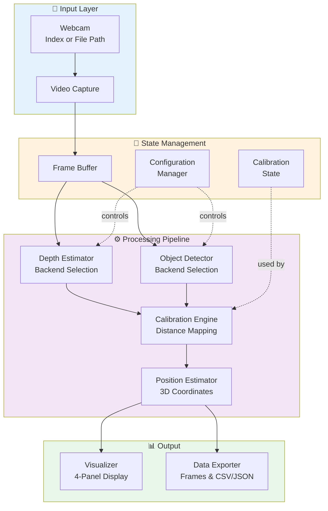
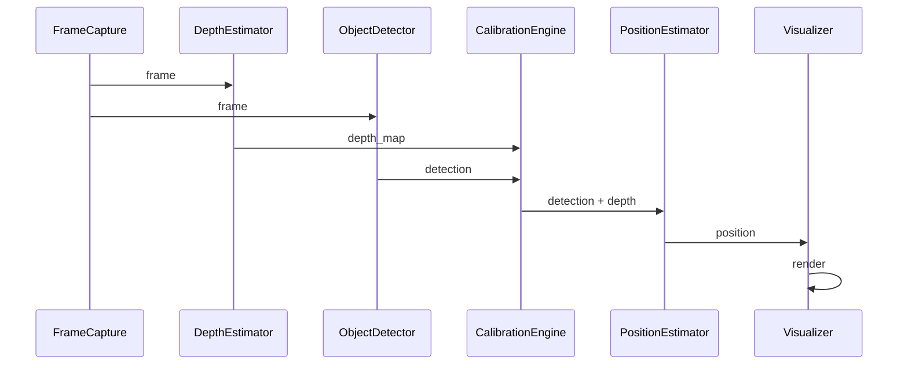
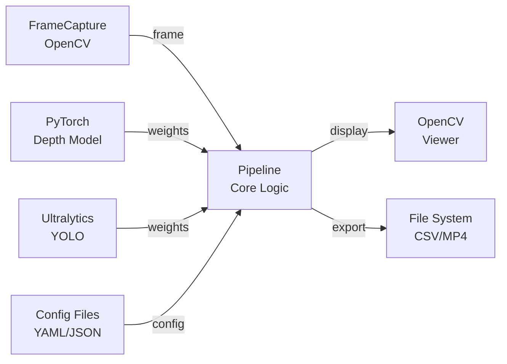

# System Architecture & Design (SWE2)

**Document ID**: SWE2-ARCH-001  
**Version**: 1.0  
**Date**: May 2026  
**Status**: Active

## 1. Overview

This document describes the system-level architecture and design decisions for the Monocular Depth Sandbox. It provides the high-level structure, components, and their interactions.

## 2. Architecture Diagram




## 3. Component Descriptions

### 3.1 Input Layer

#### FrameCapture
**Purpose**: Unified interface to video sources (webcam or file)

**Responsibilities**:
- Parse and validate video source input
- Open video capture device or file
- Handle resolution and frame rate configuration
- Read frames sequentially
- Error handling for unavailable sources

**Key Methods**:
- `__init__(source: int|str, resolution: tuple, fps: float)`
- `read() -> np.ndarray | None`
- `is_open() -> bool`
- `get_properties() -> dict`

### 3.2 Processing Components

#### DepthEstimator (Abstract)
**Purpose**: Provide pluggable depth estimation backends

**Backends**:
1. **PseudoDepth**: Fast OpenCV-based (edge/corner detection)
   - Latency: ~5ms
   - Accuracy: Low (baseline only)
   - No GPU required

2. **DepthAnythingV2**: AI model-based
   - Model: Depth Anything v2 Small (HuggingFace)
   - Latency: ~45-60ms on RTX 4060 Ti
   - Accuracy: High (±10% within 5m)
   - GPU required: ~2GB VRAM

**Key Methods**:
- `estimate(frame: np.ndarray) -> np.ndarray` (0-1 normalized)
- `preload_model()` (async initialization)
- `is_available() -> bool`

#### ObjectDetector (Abstract)
**Purpose**: Provide pluggable object detection backends

**Backends**:
1. **DepthBlobDetector**: Contour-based detection on depth map
   - Latency: ~3ms
   - Finds nearest depth discontinuity
   - No GPU required

2. **YOLOPhoneDetector**: YOLO v8 with phone class filtering
   - Model: YOLOv8 from Ultralytics
   - Latency: ~15-25ms on CPU, ~5-10ms on GPU
   - Confidence threshold: configurable (default 0.5)
   - Class filter: cell phone only

**Key Methods**:
- `detect(frame: np.ndarray, depth: np.ndarray) -> Detection[]`
- `preload_model()`
- `is_available() -> bool`

**Detection Object**:
```python
class DetectedObject:
    bbox: tuple[int, int, int, int]  # (x1, y1, x2, y2)
    center: tuple[int, int]          # (cx, cy)
    relative_depth: float            # 0-1
    distance_m: float | None         # calibrated distance
    x_m: float | None                # lateral position
    label: str                       # object label
    confidence: float | None         # detection confidence
```

#### CalibrationEngine
**Purpose**: Map relative depth to absolute distance using one-point calibration

**Calibration Model**:
```
distance_m = a * relative_depth + b

Where:
- relative_depth ∈ [0, 1]
- User provides: known_distance_m at one known relative_depth value
- Solver estimates: a, b such that curve fits calibration point
```

**Key Methods**:
- `calibrate(relative_depth: float, known_distance_m: float)`
- `estimate_distance(relative_depth: float) -> float | None`
- `is_calibrated() -> bool`
- `reset()`

#### PositionEstimator
**Purpose**: Convert detection + depth + calibration to 3D position

**Coordinate System**:
- **Z-axis**: Forward distance (depth) in meters
- **X-axis**: Lateral offset in meters (positive = right)
- **Calculation**:
  ```
  z = calibrate(relative_depth)
  x = (center_x - image_center_x) * z * tan(half_fov) / image_width
  ```

**Key Methods**:
- `estimate(detection: DetectedObject, fov_degrees: float) -> Position`

### 3.3 State Management

#### ConfigurationManager
**Purpose**: Handle CLI args and config files

**Supported Options**:
- `--source <webcam_index|file_path>` (default: 0)
- `--depth-backend <pseudo|depth-anything>` (default: depth-anything)
- `--detector <depth-blob|yolo-phone>` (default: yolo-phone)
- `--output-dir <path>` (default: data/output)
- `--resolution <WxH>` (default: 1280x720)
- `--config <config_file_path>`

**Key Methods**:
- `__init__(args: list[str])`
- `get(key: str) -> any`
- `save_to_file(path: str)`
- `load_from_file(path: str)`

#### CalibrationState
**Purpose**: Persistent storage of calibration parameters

**Storage**:
- In-memory during session
- Optional persistence to JSON file

**Key Methods**:
- `save(path: str)`
- `load(path: str)`
- `export() -> dict`

### 3.4 Output Layer

#### Visualizer
**Purpose**: Render 4-panel real-time display

**Panels** (2x2 layout):
1. **Top-Left**: Original frame with detection box + center
2. **Top-Right**: Depth heatmap with color gradient
3. **Bottom-Left**: Detection overlay with distance label
4. **Bottom-Right**: Top-down position plot with trajectory

**Key Methods**:
- `render(frame, depth, detection, position) -> np.ndarray`
- `show(image: np.ndarray, title: str, wait_ms: int)`

#### DataExporter
**Purpose**: Save frames and position data

**Export Formats**:
- **Frames**: PNG/JPEG (timestamped)
- **Position Data**: CSV or JSON
- **Video**: MP4 (optional)

**CSV Schema**:
```
timestamp,frame_number,x_m,z_m,confidence,bbox_x1,bbox_y1,bbox_x2,bbox_y2
```

**Key Methods**:
- `export_frame(frame: np.ndarray, timestamp: float)`
- `export_position(position: Position, timestamp: float)`
- `finalize_video()` (if video export enabled)

## 4. Data Flow



## 5. Design Patterns

### 5.1 Strategy Pattern
**Usage**: `DepthEstimator` and `ObjectDetector` abstract classes  
**Benefit**: Pluggable backends without modifying core logic

### 5.2 Factory Pattern
**Usage**: `DepthEstimatorFactory` and `DetectorFactory`  
**Benefit**: Centralized instantiation of backends based on configuration

### 5.3 State Pattern
**Usage**: `CalibrationEngine` manages calibration state  
**Benefit**: Encapsulates calibration logic and state transitions

### 5.4 Observer Pattern (Future)
**Usage**: Event-driven updates for real-time data  
**Benefit**: Loose coupling between components

## 6. Integration Points



## 7. Quality Attributes

### 7.1 Modularity
- Clear separation of concerns
- Each component has single responsibility
- Easy to add new backends or modify existing

### 7.2 Extensibility
- Abstract base classes for backends
- Factory pattern for instantiation
- Configuration-driven behavior

### 7.3 Performance
- Asynchronous model loading
- Frame buffering to prevent bottlenecks
- GPU acceleration for heavy computation

### 7.4 Reliability
- Graceful degradation (fallback to pseudo-depth)
- Error handling at integration points
- Optional model preloading

## 8. Known Issues & Trade-offs

| Issue | Mitigation |
|-------|-----------|
| Model load time on first run | Preload on app startup |
| Single calibration point may drift | Implement recalibration mechanism |
| Pseudo-depth accuracy limited | Use for baseline testing only |
| GPU memory consumption | Monitor and implement frame throttling |

---

**Approved By**: Architecture Team  
**Reviewed By**: Tech Lead  
**Next Review Date**: Q3 2026
