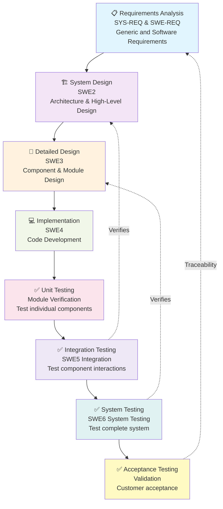

# V-Model Overview

The V-Model is a software development methodology that emphasizes verification and validation at each stage of development. This document outlines the V-Model structure for the Monocular Depth Sandbox project.

## V-Model Architecture



## Phase Descriptions

### Left Side (Descending - Definition)

#### 1. **Requirements Analysis** (REQ)
- **SYS-REQ**: System-level functional and non-functional requirements
- **SWE-REQ**: Software-specific requirements derived from system requirements
- **Artifacts**: System Requirements Document, Software Requirements Specification

#### 2. **System Design** (SWE2)
- High-level architectural design
- Component identification and interaction design
- Interface definitions
- Design patterns and trade-off analysis
- **Artifacts**: System Architecture Document, Design Specification

#### 3. **Detailed Design** (SWE3)
- Component-level detailed design
- Algorithm specifications
- Data structure definitions
- Interface specifications
- **Artifacts**: Detailed Design Document, Component Specifications

#### 4. **Implementation** (SWE4)
- Code development following design specifications
- Unit-level development
- **Artifacts**: Source code, code documentation

### Right Side (Ascending - Verification & Validation)

#### 5. **Unit Testing**
- Tests for individual modules/components
- Verification against detailed design
- **Artifacts**: Unit test cases, unit test reports

#### 6. **Integration Testing** (SWE5)
- Tests for component interactions
- Verification against system design
- **Artifacts**: Integration test cases, integration test reports

#### 7. **System Testing** (SWE6)
- Tests for complete system functionality
- Verification against software requirements
- **Artifacts**: System test cases, system test reports

#### 8. **Acceptance Testing** (VAL)
- Tests for user/customer acceptance
- Validation against system requirements
- **Artifacts**: Acceptance test cases, acceptance test reports

## Traceability Flow

```
Requirements (REQ)
    ↓ (Traced by)
System Design (SWE2)
    ↓ (Refined by)
Detailed Design (SWE3)
    ↓ (Implemented by)
Code (SWE4)
    ↓ (Verified by)
Unit Tests + Integration Tests + System Tests
    ↓ (Validated by)
Acceptance Tests
    ↓ (Traces back to)
Requirements (REQ)
```

## Key Principles

1. **Traceability**: Every requirement is traced through design to code to tests
2. **Verification**: Ensures that what is built is built correctly (design → code)
3. **Validation**: Ensures that the right thing is built (requirements → tests)
4. **Quality Gates**: Each phase has defined entry and exit criteria
5. **Bidirectional Verification**: Changes at any level are reflected in verification plans

## ASPICE Alignment

This V-Model aligns with ASPICE (Automotive SPICE) process model:
- **Process SWE2**: Ensures well-structured system design
- **Process SWE3**: Ensures detailed design before coding
- **Process SWE4**: Ensures code follows design
- **Process SWE5**: Ensures integration verification
- **Process SWE6**: Ensures system verification
- **Process SWE7**: Ensures software release (not detailed here)

---

**Document Version**: 1.0  
**Last Updated**: May 2026  
**Status**: Active
